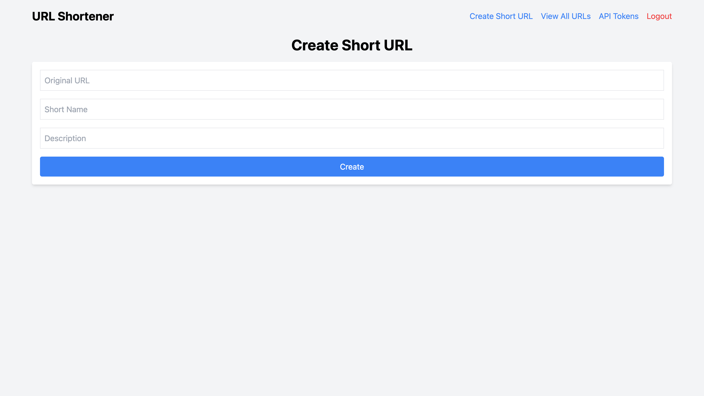

# Short URL generator

The Short URL generator is a web application that generates short URLs for a given long URL. The application uses the [FastAPI](https://fastapi.tiangolo.com/) framework and the [Jinja2 Templates](https://jinja.palletsprojects.com/en/3.0.x/) library to generate the short URLs. The application also includes a login system to ensure that only authorized users can access the application.

The database is stored in a JSON file, which is encrypted using the [cryptography](https://cryptography.io/en/latest/) library. The encryption key is stored in an environment variable, which is used to decrypt the JSON file. The encryption key is generated using the `app/scripts/generate-key.py` script, which can be run using the following command:

```bash
python generate-key.py
```

The `app/scripts/generate-key.py` script generates a random key and prints it to the console. If you want also to initialize the database, you can run the `init-urls-json-file.py` script, this script initializes the database (urls.json) with an empty array.:

```bash
python init-urls-json-file.py
```

### Create Short URL

You can create a new short URL by providing the original URL and a short name.



### View All URLs

You can view all the URLs created by the application and also by the API.


### Edit URL

You can edit the original URL, short name, and description of a URL.


### Managing API Tokens

You can create and manage API tokens to access the API endpoints.


### API Documentation

You can find the API documentation published automatically in the [Swagger UI](http://localhost:3000/docs). Through this documentation, you can easily interact with the API endpoints, for example, to create a new URL, edit an existing URL, or delete a URL.


## Requirements

- Python 3.8+
- [FastAPI](https://fastapi.tiangolo.com/)
- [Jinja2 Templates](https://jinja.palletsprojects.com/en/3.0.x/)
- [cryptography](https://cryptography.io/en/latest/)

# Running the project locally

1. Create the Python virtual environment

```sh
python3 -m venv short-url-generator
```

```sh
source short-url-generator/bin/activate
```

2. Install dependencies:

It is recommended, first, upgrade pip:
```sh
pip install --upgrade pip
```

Install dependencies/requirements:
```sh
pip install -r requirements.txt
```

3. Execute the following command:

```sh
uvicorn app.main:app --reload --host 0.0.0.0 --port 3000
```

4. You should see an output similar to:

```
INFO:     Uvicorn running on http://127.0.0.1:3000 (Press CTRL+C to quit)
INFO:     Started reloader process [XXXXX] using WatchFiles
INFO:     Started server process [XXXX]
INFO:     Waiting for application startup.
INFO:     Application startup complete.
```

# Running the project with Docker

1. Build and Run the Docker image:

```bash
docker build -t short-url-generator .
docker run -p 3000:3000 short-url-generator
```

or you can use the `docker-compose.yml` file:

```bash
docker-compose up -d
```

## Licensing

All packages in this repository are open-source software and licensed under the [MIT License](https://github.com/joakimvivas/marco-bot/blob/main/LICENSE). By contributing in this repository, you agree to release your code under this license as well.

Let's build the future of **Short URL Generator** together!